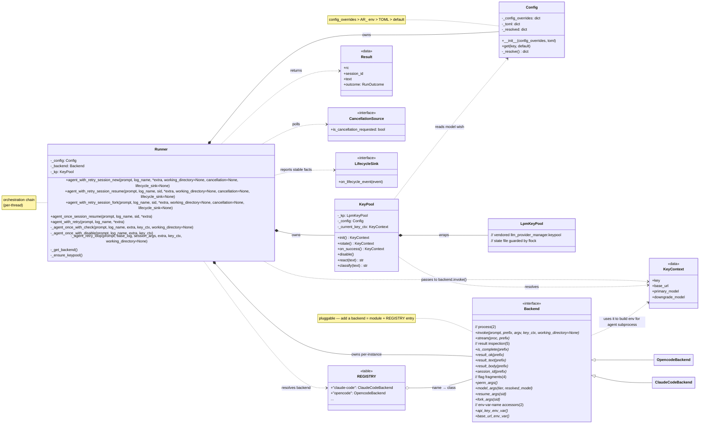

# Architecture (agent-runner)

> Implementation & concurrency reference. For **usage**, see [README.md](README.md). This doc covers *how it's built* and *why it's safe under concurrency*.

agent-runner is a standalone, cross-platform (POSIX) Python package with **no runtime dependency on bash or `jq`**. The vendored `llm-provider-manager` (lpm) is bundled inside.

## Class diagram



Legend:

- `*--` composition (owns)
- `o--` aggregation (holds refs)
- `..|>` realization (Protocol implementation)
- `..>` dependency (uses / data flow)

The two concrete backends are shown as leaves to emphasize pluggability.

## Layered orchestration

For each invocation the engine: (1) checks cancellation, selects a key + provider config from the pool, then rechecks cancellation immediately before spawn, (2) runs the agent in a backgrounded process group, (3) watches for cancellation / early completion / stall / hard timeout (killing and reaping the whole tree on cancellation or timeout), (4) on failure **reactively** classifies the error and applies one recovery step (disable bad key / rotate to next / downgrade model), then rechecks cancellation before dispatching a retry. The legacy `Result.rc` remains `0/1/2`; `Result.outcome` preserves the stable reason (`stall_timeout`, `attempt_timeout`, `canceled`, and so on).

**Layers (each adds one capability):**

| Layer | Adds | Disable side-effects? |
|---|---|---|
| `_agent_once_with_check` | watchdog + business-result check (`result_ok`) | no |
| `_agent_once_with_disable` | + self-disable on failure (single-shot entry) | yes (own disable) |
| `_agent_retry_loop` | + reactive retry (react → disable/rotate/downgrade → retry) | yes (loop-top `react`) |
| `agent_with_retry_session_{new,resume,fork}` | + session semantics (new/resume/fork flags) | delegates to loop |

**Invariants:**

- **Disable watershed**: the public entries' primary attempt runs `_with_check` (does NOT disable). disable / rotate / downgrade are decided by `_retry_loop` at the top of each iteration via `react`, uniformly. Single-shot entries (`_with_disable`) self-disable because they have no outer loop.
- **Reactive retry**: each failure is re-classified via `react`; after rotating to a new key, a different error code yields a befitting strategy.
- **Continue vs redo**: prefer continuing on the session_id the primary recorded (`继续` prompt + `--resume <sid>`); with no session, replay the primary verbatim (re-send `$prompt` + `$session_args`). Fork re-forks from the source session — never bare-resumes a shared context (would pollute sibling forks).
- **Exit codes**: `_with_check` → 0/1; `_retry_loop` and the public entries → 0/1; `_with_disable` → 0/1/2 (2 = quota exhausted, no key pool).
- **Never trust the process returncode**: success is always judged by `result_ok` reading the jsonl.

## Backends: the 11-op contract

`agent_runner/backends/` — one module per agent CLI implementing the 11-op contract consumed by the engine, using `subprocess` + the `json` stdlib (no `jq`). Current backends: `claude_code.py`, `opencode.py`.

The contract (`backends/__init__.py:Backend`):

```
invoke(prompt, prefix, argv, key_ctx=None, *, working_directory=None)
                                               ── start agent subprocess; env from key_ctx,
                                                  cwd from this invocation only
stream(proc, prefix)                          ── stdout → <prefix>.jsonl (reader thread)
is_complete(prefix)                            ── watchdog early-exit predicate
result_ok / result_text / result_body / session_id  ── read <prefix>.jsonl
perm_args / model_args(tier, resolved_model="") / resume_args / fork_args  ── flag fragments
api_key_env_var / base_url_env_var            ── env-var names (extra_env keys)
```

**REGISTRY** maps names → **classes** (not singletons): each `Runner` instantiates its own backend with its own `Config` (`REGISTRY[name](config=...)`), so multi-threaded callers each get an isolated backend. Adding a backend = a new module + one `REGISTRY` entry; the engine never references a concrete agent.

Backends hold **no shared mutable state**: per-call handles (the err file) are attached to the returned `Popen` (`proc._ar_err`), never to instance attributes, so concurrent invocations never clobber each other's err handle.

## Configuration: the `Config` class

`agent_runner/config.py`. Each `Runner` holds its own `Config` instance, resolved once at construction (no module-level cache, no `clear_cache`). Priority: **`config_overrides` (per-instance) > `AR_` env (process) > TOML > hard-coded default**.

- `SPECS` (the `Spec` declaration table) is the **shared schema** (key / type / default / TOML path) — module-level, read-only, identical for all instances.
- **`config_overrides`** is the per-instance "fine-tuning" channel (canonical keys, e.g. `{"primary_model": "glm-4.7", "stall_timeout": 600}`), enabling different Agents / threads to be tuned independently. Highest priority.
- `Runner(..., *, discover_config_files=False)`通过既有 `Config(config_overrides, toml={})`为嵌入方建立显式配置视图；它只关闭 `$AR_CONFIG_FILE` / CWD / 用户目录 TOML 发现，不关闭 `AR_` 环境层。该参数只接受 exact `bool`，默认 `True`保持向后兼容的文件发现行为。
- `lpm_src` is process-level (`sys.path` is process-global); resolved once on first `KeyPool` construction via the lock-guarded `_ensure_lpm`.
- A lock-guarded module-level default `Config` exists only as a backward-compat shim for bootstrap / process-mode; production paths read the owning `Runner`'s instance.

**Model selection**: `primary_model`/`downgrade_model` express the caller's wish. The key pool checks if the requested model is in the provider's available `models` list (from `providers.jsonc`); if yes → use it, if not → fall back to the provider's declared `primaryModel`/`downgradeModel`. No key pool → pass through to the agent as-is. Model names are **never hard-coded** in agent-runner — they come from config/provider. (At runtime the resolved model flows through `KeyContext` → `backend.model_args(resolved_model=...)`, bypassing the `AR_*` env round-trip — see concurrency below.)

## Cross-platform

- **Paths**: `pathlib` throughout; no hardcoded Unix separators; agent binaries resolved via `PATH`. Output/state live under the caller-supplied `run_dir` (never hardcoded `/tmp`).
- **Key-pool locking** (vendored lpm `keypool.py`): the advisory file lock guarding the shared state file is platform-abstracted into `_flock_*` helpers — `fcntl.flock` on POSIX, `msvcrt.locking` (degraded to exclusive) on Windows. Mutual exclusion is preserved on both; only read concurrency drops on Windows.
- **Watchdog process-tree kill** (`platform.py`): `kill_tree` is abstracted behind a `Platform` interface — POSIX uses process groups (`setsid` + `killpg`); the Windows implementation is a stub (extension point).

## Concurrency model (multi-threaded)

agent-runner is safe to call concurrently from multiple threads of one host process. This section is the load-bearing reasoning.

### The 1 Runner : 1 thread : (sequential) agent-process relationship

A `Runner` instance is the **isolation boundary** for one orchestration chain. It is **not** bound to a single agent process: over its lifetime it drives a **sequence** of agent processes — retries within one call (kill one, spawn the next), and multi-step sessions across calls (`new → resume → resume`), one in-flight at a time. So the accurate correspondence is:

```
1 ar-thread  ↔  1 Runner  ↔  a sequence of agent processes (one in-flight at a time)
```

Give each thread its own `Runner` and there is **no shared mutable state** across threads (Config / backend / keypool all per-instance). The module-level public functions (`agent_with_retry`, …) delegate to a **thread-local default `Runner`**, so even without an explicit `Runner()` each thread automatically gets its own — single-threaded callers need zero changes to go concurrent.

### The transparent dual-track

| Track | When | How |
|---|---|---|
| **Transparent** | module-level `agent_with_retry(...)` etc. | delegates to thread-local default `Runner` (lazy, per-thread) |
| **Explicit** | `Runner(config_overrides=..., discover_config_files=...)` then `r.agent_with_retry(...)` | 每个实例独占 Config/backend/keypool，支持完整隔离与多 Agent 微调；嵌入方可关闭候选 TOML 发现 |

### Concurrency guarantees

| # | Guarantee |
|---|---|
| ① | **no `os.environ` writes**: keypool's `_resolve_entry` returns a pure `KeyContext`; the engine threads it to `backend.invoke(key_ctx=...)`, which builds `Popen(env={**os.environ, **extra_env})` — each agent subprocess gets its own isolated env snapshot. |
| ② | **no shared orchestration state**: all state lives on the `Runner` instance; one Runner per thread. |
| ③ | **backends hold no per-call mutable state**: `REGISTRY` maps to classes (per-Runner instances); the err handle attaches to the returned `Popen` (`proc._ar_err`), never to the instance. |
| ④ | **no unsynchronized config cache**: `Config` is resolved once per instance at construction; the only module-level default is lock-guarded, for bootstrap/back-compat only. |
| ⑤ | **diagnostic stderr needs no lock**: agent subprocess stderr goes to per-call `<prefix>.err` files; the process stderr receives only single-line engine diagnostics, and a single `sys.stderr.write(s)` is atomic under the GIL — at worst whole-line reordering, never mid-line garble. |

### The `KeyContext` flow (why no env round-trip)

The resolved model flows directly (no env round-trip):

```
keypool._resolve_entry(entry) → KeyContext{ key, base_url, primary_model, downgrade_model }
   └ engine threads it to:
      backend.model_args(tier, resolved_model=key_ctx.<tier>_model)   # direct, no env
      backend.invoke(
          prompt, prefix, argv, key_ctx=key_ctx, working_directory=working_directory
      )  # → Popen env + cwd for this agent subprocess only
```

`key_ctx=None` (no key pool) → `Popen` inherits `os.environ` as-is; `model_args` resolved_model empty → falls back to the startup-time `AR_*` env (set once, read-only, no per-call race).

`working_directory` is keyword-only on the explicit `Runner` new/resume/fork
entries and is passed unchanged to every attempt, including internal retries.
Backends map it only to `Popen(cwd=...)`; `None` preserves the legacy caller
working directory. The engine never calls `os.chdir()`, so concurrent
invocations cannot change the host process directory.

### thread-safe ⟹ process-safe

This implication holds, with two axes distinguished:

**① In-process state** (Runner memory, `Config`, `os.environ`): thread-safety is the *finer* guarantee. A process has isolated memory + env, so **thread-safe ⟹ process-safe** here exactly because process granularity is coarser. This is what the design above delivers.

**② Shared external resources** — safe for reasons *independent* of the thread work, in both axes:

- **keypool state file** (`key-pool-state.json`): guarded by lpm's `flock`. **`flock(LOCK_EX)` (BSD, per-open-file-description) blocks across separate fds even within one process** — unlike POSIX `fcntl F_SETLK` (per-process, the famous "a process can't deadlock itself" gap that breaks thread mutual exclusion). lpm uses the former, so per-Runner `KeyPool`s (each `open()`-ing the state file separately) are correctly serialized under both thread and process contention.
- **output files** (`<run_dir>/<log_name>.{jsonl,err}`): per-`log_name` by caller contract — distinct names per invocation, same standard for both axes.

Net: multi-thread usability implies multi-process usability for the in-process state (finer ⟹ coarser); the shared state file is safe in both axes via `flock`; the design neither regressed the process axis nor left a within-process `flock` gap.

## Self-containment

agent-runner is a standalone Python package (stdlib-only). lpm is vendored as a source copy at `llm-provider-manager/`; upstream lpm changes are synced by re-copying. `lpm_src` / `AR_LPM_SRC` can point elsewhere for development.

Progress tracking (the `progress_read`/`progress_write`/`progress_iterations` state machine) is out of scope; this project does not provide it.
